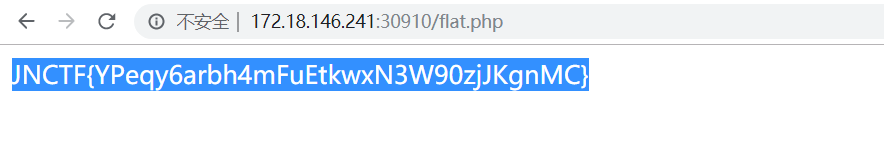

# JNCTF-2019 : do_you_know_302

## **【原理】**

HTTP响应头Location可进行网页重定向

## **【目的】**

考察抓包观察http响应头或重定向跳转过程

## **【环境】**

Apache+PHP

## **【工具】**

burpsuite

## **【步骤】**

开局直接跳转到flag.php,发现flag is not here,猜测存在302跳转

burpsuite抓包查看302跳转过程，发现明显语义：If_you_want_to_get_ffflaglaglat,please_delete_the_flag,

那么将ffflaglaglat.php删掉flag后变为fflaglat.php，再删去一次flag,变为flat.php，访问flat.php，即可得到flag

## **【总结】**

302跳转有时候可以隐藏很多信息，http请求头或者响应头也会有很多隐藏信息