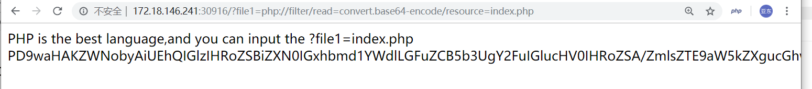
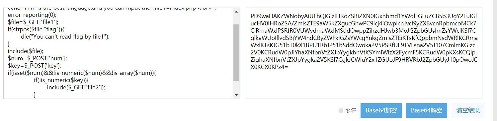
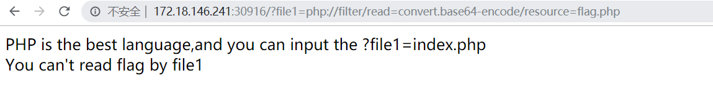
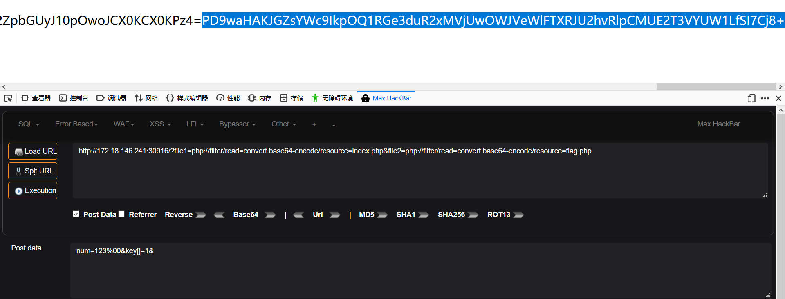
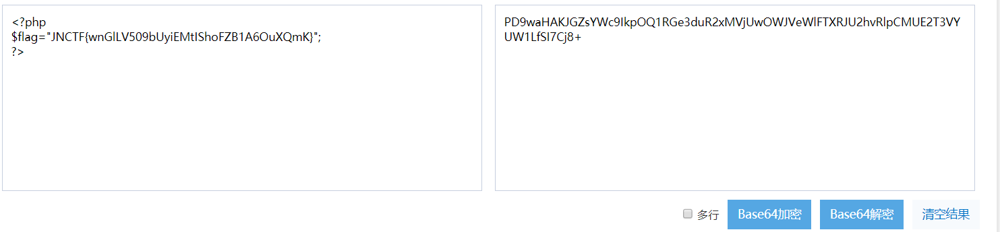

# JNCTF-2019 : easy_php

## **【原理】**

文件包含、常见PHP代码审计，简单函数绕过

## **【目的】**

考察选手的简单代码审计能力

## **【环境】**

Apache+PHP

## **【工具】**

无

## **【步骤】**

F12发现提示可以get参数file1，并且可以通过php的filter协议直接读取index源码,base64解码即可

尝试读取flag.php

发现我们没法通过file1来读取flag.php，但有了index.php的源代码

简单审计，发现绕过num和key即可，num可以用%00绕，key可以用数组绕过，然后通过file2参数读取flag.php即可

 base解码就能够得到flag

## **【总结】**

了解PHP的filter伪协议，绕过常见的PHP漏洞函数