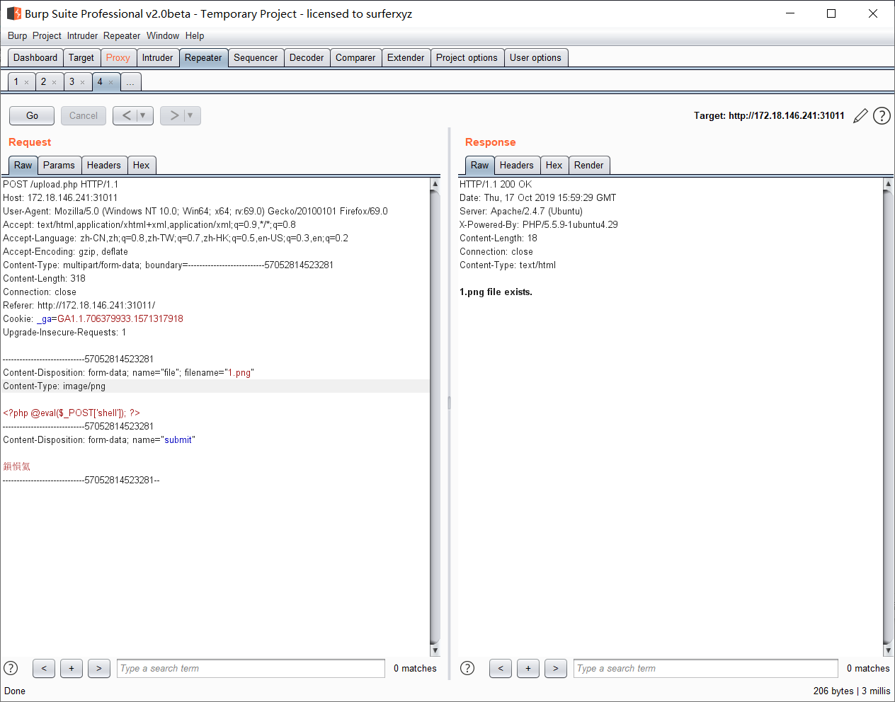
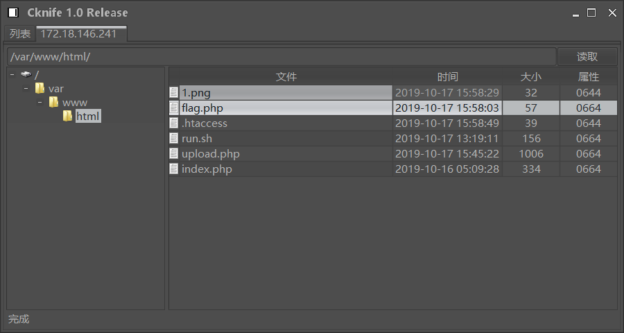
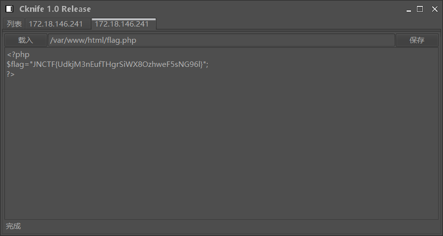

# JNCTF-2019 : 

## **【原理】**

文件上传漏洞

## **【目的】**

了解文件上传常见绕过方式

## **【环境】**

Apache+PHP

## **【工具】**

无

## **【步骤】**

测试发现无法上传php文件，其他文件如php3、php5、phtml等也都无法上传，但是.htacess文件可以上传，于是上传图片一句话木马，结合.htaccess进行解析getshell即可

传一句话木马

传.htaccess

getshell

## **【总结】**

典型的图片文件+.htacess解析，为减小难度未做图片格式验证