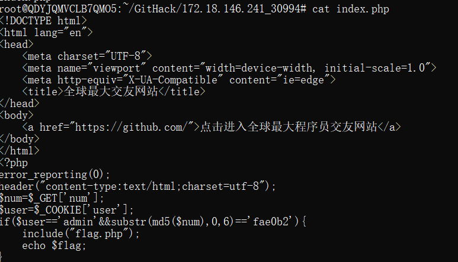
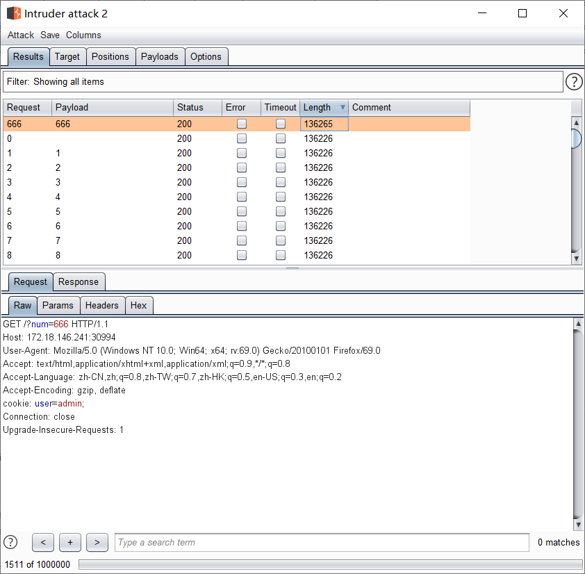
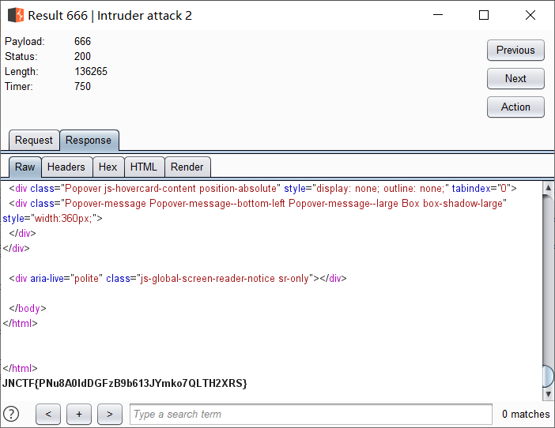

# JNCTF-2019 : 

## **【原理】**

git源码泄露+简单代码审计

## **【目的】**

考察选手的信息收集+代码审计能力

## **【环境】**

apache+php+git

## **【工具】**

Githack

## **【步骤】**

首页为github界面，猜测为git源码泄露，验证发现确实是，利用githack恢复源代码

```
python GitHack.py http://172.18.146.241:30994/.git/
```



令cooker['user']字段为admin并且简单爆破一下md5就能拿到flag





## **【总结】**

部署网站与服务器的时候记得删除备份文件，以防源码泄露