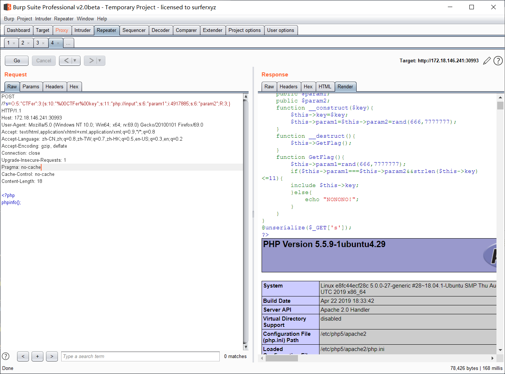
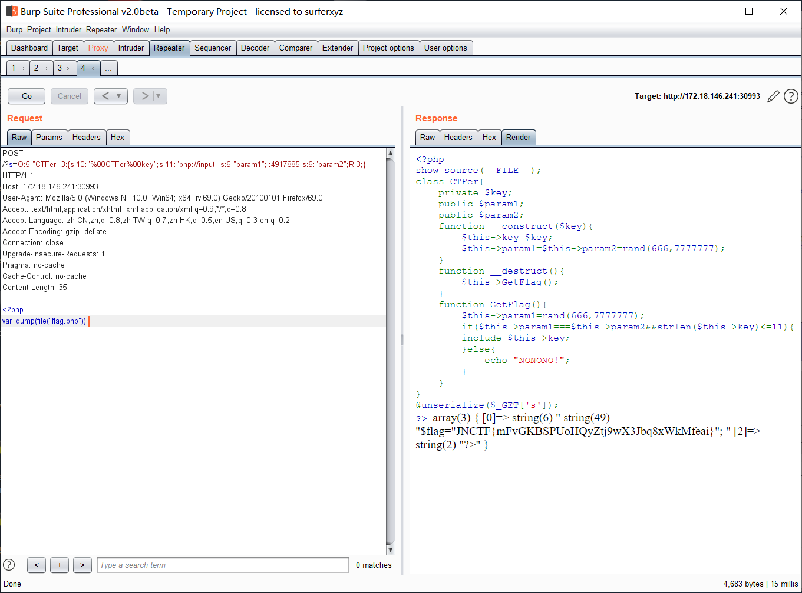

# JNCTF-2019 : hard_php

## **【原理】**

反序列化漏洞的利用，PHP的input伪协议

## **【目的】**

考察选手的反序列化利用综合能力，如何利用小trick绕过限制

## **【环境】**

apache+php

## **【工具】**

无

## **【步骤】**

反序列化漏洞，简单代码审计可知，只要令param1为param2的引用即可，那么不管其中的一个怎么变，另一个参数的值都与其保持一致，但是只有一个简单的include如何利用呢，这里利用一个PHP的input伪协议，采用POST方式，想需要的读取flag.php文件的代码post过去即可获得flag

```
O:5:"CTFer":3:{s:10:"%00CTFer%00key";s:11:"php://input";s:6:"param1";i:4917885;s:6:"param2";R:3;}
```






## **【总结】**

骚套路绕限制，花样拿flag