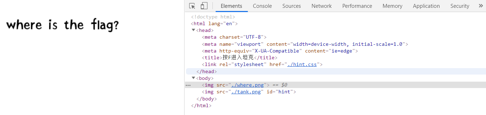

# JNCTF-2019 : press_f_into_the_tank
## **【原理】**

F12可以查看源代码，CSS控制样式

## **【目的】**

送分

## **【环境】**

Apache

## **【工具】**

有浏览器可查看网页源代码即可

## **【步骤】**

题目意为F进入坦克，很容易想到F12查看源代码

发现hint.css，其中将id='hint'标签的透明度设为0

查看id为hint标签的图片

得到flag为

JNCTF{FfFfFfFf_enter_the_tank}

## **【总结】**

F12查看源代码，有时候会有很多的重要提示