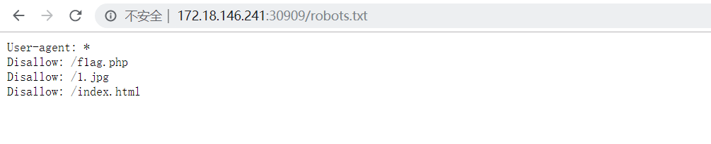
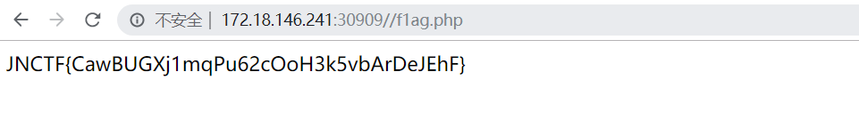

# JNCTF-2019 : 

## **【原理】**

*robots*是网站跟爬虫间的协议，用简单直接的txt格式文本方式告诉对应的爬虫被允许的权限，也就是说*robots*.txt是搜索引擎中访问网站的时候要查看的第一个文件。

## **【目的】**

考察*robots*协议，送分

## **【环境】**

apache+php

## **【工具】**

无

## **【步骤】**

首页发现图片是个机器人（robot)，猜测为robots.txt协议

访问发现f1ag.php（注意是f1ag.php不是flag.php喔）

访问即可得到flag

## **【总结】**

robots协议有时候会暴露很多有意思的内容喔